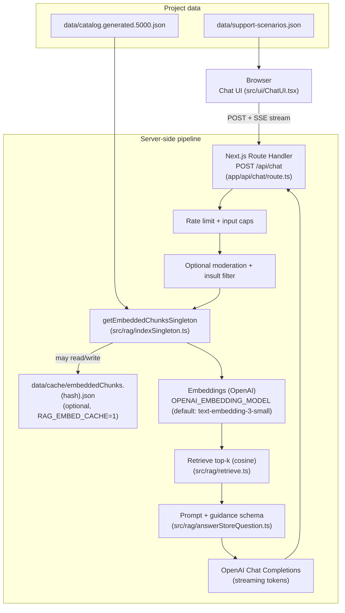
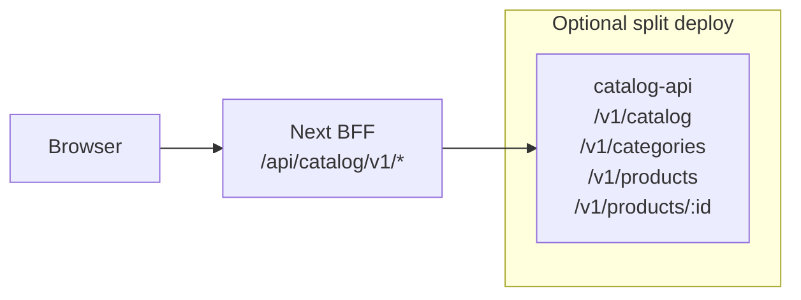

## Tech Store RAG Chat — Architecture

**High-level picture (no file paths):** open [`architecture-overview.svg`](./architecture-overview.svg) in a browser or any SVG viewer, or embed it in slides.

This project is a **Next.js web UI** backed by a **server-side RAG pipeline** (retrieval + grounded generation) using the OpenAI SDK. The client never sees your `OPENAI_API_KEY`.

### High-level diagram

### Speech-to-text (optional voice input)

The UI can use the browser’s Web Speech API, and (when needed) falls back to server-side transcription:
- `POST /api/speech/transcribe` (`app/api/speech/transcribe/route.ts`) accepts a short audio clip (`multipart/form-data`) and transcribes it with OpenAI (`OPENAI_TRANSCRIPTION_MODEL`, default `whisper-1`).

### Catalog service + BFF (tech products)

Tech products are stored in **SQLite** by the **catalog REST service** ([`services/catalog-api`](../services/catalog-api)). On first start (or when `CATALOG_FORCE_RESEED=1`) it **seeds** from [`data/catalog.generated.5000.json`](../data/catalog.generated.5000.json) into `data/catalog.sqlite` (override with `CATALOG_SEED_PATH` and `CATALOG_DB_PATH`). It can also enrich products with `inStock` using **Redis** (optional) when `REDIS_URL` / `CATALOG_REDIS_URL` is set.

Next.js proxies the service under **`/api/catalog/v1/*`** using **`CATALOG_API_BASE_URL`** (server-only). See [CATALOG_SERVICE_AND_BFF.md](./CATALOG_SERVICE_AND_BFF.md).

### Key components
- **UI**: `src/ui/ChatUI.tsx`
  - Streams assistant output (SSE) into a single message bubble.
  - Shows guided “tree” suggestions at the start of the chat.
  - Has a **New chat** button that aborts in-flight requests and clears state.
  - Displays a deterministic **relevance/confidence** score returned by the server.

- **API**: `app/api/chat/route.ts`
  - Rate limiting + input caps
  - Optional moderation (`RAG_USE_MODERATION=1`)
  - RAG retrieval + streaming response via SSE

- **RAG core**: `src/rag/answerStoreQuestion.ts`
  - Retrieval confidence gate (`RAG_MIN_SCORE`)
  - “Guidance JSON” parsing to return structured clarifiers + suggested next questions
  - Prompt-injection guardrail (treat retrieved context as untrusted)

- **Index caching**: `src/rag/indexSingleton.ts`
  - In-memory singleton per warm server instance
  - Optional disk cache: `RAG_EMBED_CACHE=1` writes `data/cache/embeddedChunks.<hash>.json` (hash = catalog content + embedding model)

### Image export (optional)
If you specifically need a PNG image, you can export the Mermaid diagram using:
- VS Code / Cursor Mermaid preview export, or
- GitHub rendering screenshot, or
- Mermaid CLI (mmdc).

